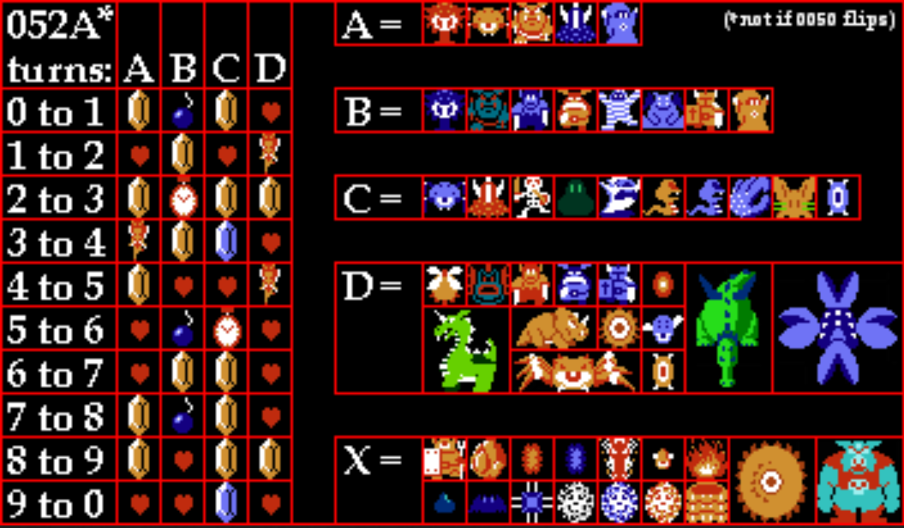

# The Legend of Zelda Combat Kata
*The Legend of Zelda* is a classic game available on the Nintendo Entertainment System and countless other formats. This Kata focuses on simulating the game's item drop system, that is used to determine what an enemy drops (if anything) upon defeating it in the game. There is nuance to calculating the correct drop beyond random chance, which this Kata explores.

A detailed description of the Zelda combat / counter engine is available in [Engine Detail](./engine-detail.md). It's not necessary to know every aspect of the engine to complete the Kata, but may provide insight or sate curiosity.

## Combat Kata Domain Details
To implement this Kata, you must implement something that receives a **Combat Action**, and returns a **Combat Result**. The **Combat Action** represents the player playing the hero, Link, engaged with an enemy. The **Combat Result** represents the outcome of the interaction, whether Link defeats the enemy by killing it, or gets hit. For the purposes of this Kata, Link has infinite health. Lucky you!

A **Combat Action** can be one of the following:
- Kill an enemy
- Kill an enemy with a Bomb
- Get Hit

A **Combat Result** can be one of the following:
- Five Rupees
- Bomb
- Fairy
- Clock
- Heart
- Rupee
- Nothing

For determining random drops, reference the Global Drop Table. Notice that there are five enemy groups: A, B, C, D, and X. Groups A-D have items to drop, while the X group never drops anything. These come into play for when determining random drops, which you'll uncover as you progress through The Kata.

## The Kata
Additional **Combat Actions** may become available as you progress through the steps of The Kata. It will start as a bare bones implementation, and gradually add more features and functionality as you progress. By the end of the Basic Steps, you will have a simple version of *The Legend of Zelda*'s item drop system implemented. Advanced Steps go into more nuances and advanced details or one-off scenarios that rarely come up in the course of the game. Depending on the time available, you can stick to the Basic Steps, or try going for it all. Good luck!

### Basic Steps
1. Always Return Nothing
2. Consecutive Streak Bonus - Kill 10 enemies in a row to get Five Rupees on the 10th Kill
   - Streak is broken if Link gets hit, or when the bonus is reached
3. 10th Enemy has the Bomb - If the 10th enemy in a row is killed with a bomb, a Bomb is returned instead
4. Fairy Streak Bonus - Kill 16 enemies in a row to get a Fairy on the 16th Kill
   - Fairy Streak is broken if Link gets hit occurs or when the bonus is reached
   - This also breaks the Consecutive Streak
5. Global Index For Non-Bonus Item Drops
   - Modify the **Combat Action** options "kill an enemy" and "kill an enemy with a Bomb" into 10 total options:
      - "Kill enemy 'A'"
      - "Kill enemy 'A' with Bomb"
      - Repeat for B, C, D, and X
   - When there is no Bonus to return, use the Global Drop Table to find an item to return
   - The Global Drop Table requires both the enemy group (A, B, C, D, X), and the current global index value, to calculate the correct item to return
   - The global index value is defined as follows:
     - Starts at 0
     - Runs between 0-9. After 9, it returns to 0
     - Increments by 1 when a Kill occurs, unless the Group the enemy belonged to was X
     - The index is referenced for item drop calculation **before** incrementing
        - For example, the first Kill of the game should read the current Global Index (0), return from the first row ("0 to 1"), then increment the Global Index
   
### Advanced Steps
6. Global Drop Odds - When getting a drop from a Global, there is no guarantee an item is returned
   - Odds of a global drop vary by group:
      - Group A: `80/256`
      - Group B: `104/256`
      - Group C: `152/256`
      - Group D: `104/256`
   - Return Nothing on failure
7. Consecutive Streak Bonus Delay - If the 10th enemy was killed and is in the "X" group:
   - Return Nothing
   - Carry the Streak Bonus to the next Kill
   - Repeat process if next kill is also in the "X" group
   - If first non-X kill is the 16th Fairy Streak Bonus kill, Fairy gets priority over carried-over Reward
   - Streak breaks as normal, when a Streak Bonus (Consecutive or Fairy) is reached
      - Breaking a Fairy Streak continues to break the Consecutive Streak
8. Fairy Streak Bonus Skip - If the 16th enemy was killed and is in the "X" group:
   - Return Nothing
   - The Fairy Streak Bonus is skipped, and no Streaks are broken
   - Note: A Fairy Streak Bonus occurs *only* at the 16th consecutive kill, not every 16th (i.e. 32nd, 48th)
9. New **Combat Action**: "Kill Smoked Dodongo"
   - Dodongo is a particular boss enemy in *The Legend of Zelda*, that has special rules when it comes to dropping an item: If you bomb a Dodongo, it freezes in place, which then allows you to kill it with your sword (normally, it is immune to sword damage). Doing so guarantees a bomb drop regardless of count, with one exception.
   - The behavior is defined as follows:
     - The Global Index is incremented
     - The Consecutive Streak, instead of incrementing is **set to 10**
     - The Fairy Consecutive Streak is **not incremented**
     - A Bomb should be returned, as the Consecutive Streak is at 10, and Dodongo is full of Bombs to drop
     - A Bomb is **not returned** if the Fairy Counter is at 16. A Fairy is returned instead
10. New Combat Event: "Kill Dodongo with Bombs"
    - The other way to kill a Dodongo is to use multiple Bombs on it. When killed in this fashion, the following rules are applied:
    - The Global Index is incremented
    - The Consecutive Streak is **not incremented**
    - The Fairy Consecutive Streak is **not incremented**
      - If the Fairy Consecutive Streak previously reached 16, it **remains at 16, rewarding a fairy again**
      - If multiple "Kill Dodongo with Bombs" actions occur, 
11. Combined Combat Action: "Kill and Get Hit"
    - It is possible for two Actions to occur at the exact same time
    - The Enemy dies, but before any Drop is given, the player gets hit
    - Global advances, but like with "Get Hit", all Streaks are lost
    - Global drop is returned since no Bonus occurs
12. Simulate NES Limitations
    - All numbers within this system cannot exceed `255`
      - If a number would exceed `255`, it rolls back over to `0`
    - Consequence: Since Fairy Streak Bonus only resets on hit, it can wrap all the way back around to 16 to force another Fairy

## Currently Out of Scope of the Kata
Here are some details of the engine that are presently not part of the Kata, but could be potentially added in the future. The [Engine Detail](./engine-detail.md) documentation provides resources where you can read more about these advanced scenarios if you are curious!

- Differentiating "Spawning X Group Enemies" (which advance the global) from "regular X Group Enemies" (which do not)
- Killing multiple enemies at once, and getting e.g. multiple fairies
- Overkill (i.e. multiple kill counts within a single frame)
- Killing a ringleader which causes other enemies in the room to die and drop globals
